# YummiShare - Recipe Sharing App

A modern, user-friendly app for creating, managing, and sharing recipes for Android and iOS.

## 📱 Screenshots

| Screen | iOS | Android |
|--------|-----|---------|
| **Home** | 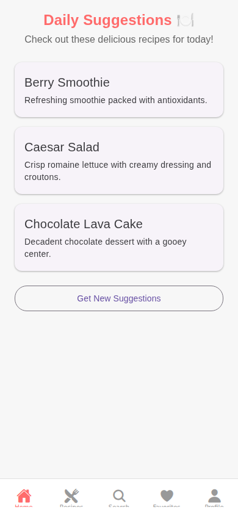 | 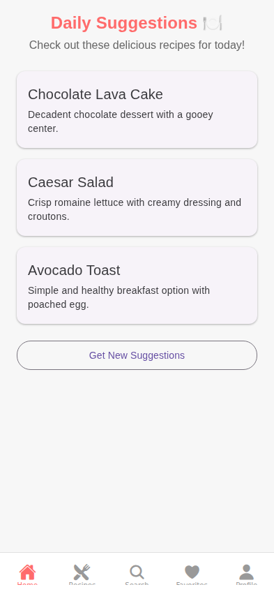 |
| **Recipes** | 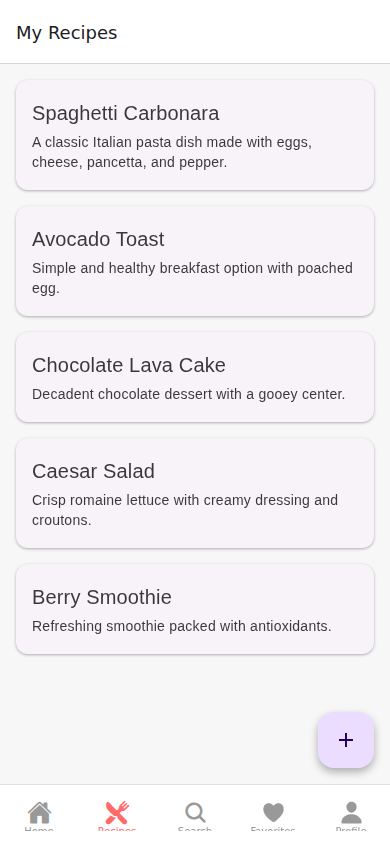 | 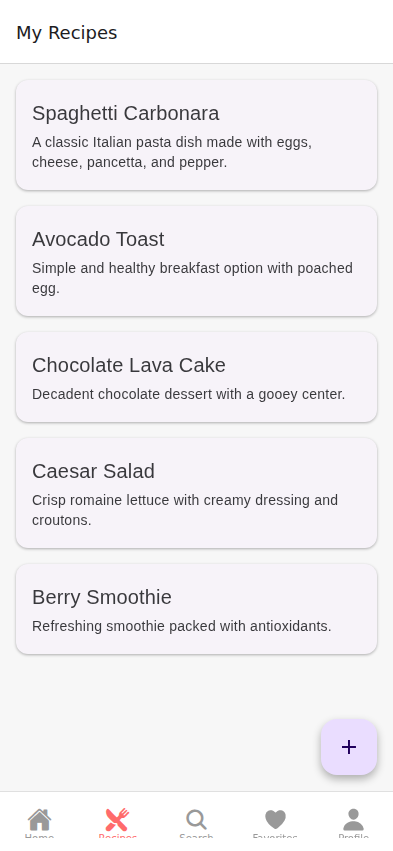 |
| **Detail** | 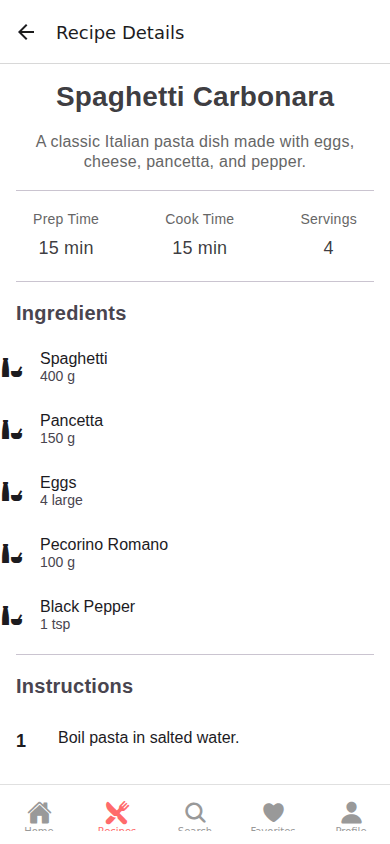 | 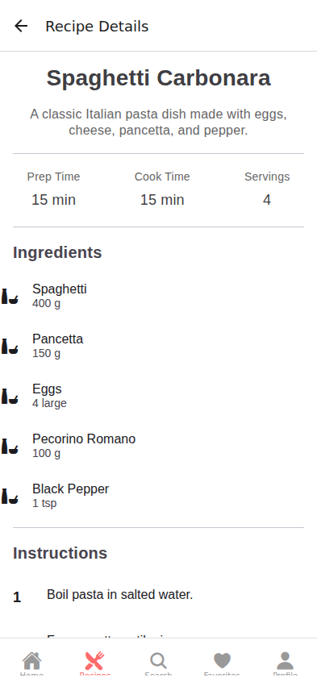 |
| **Create** | 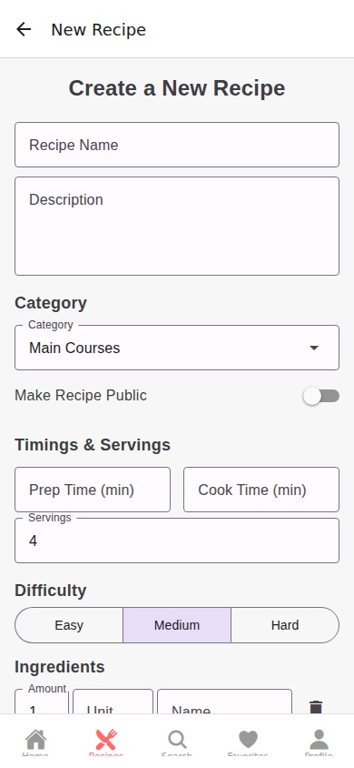 | 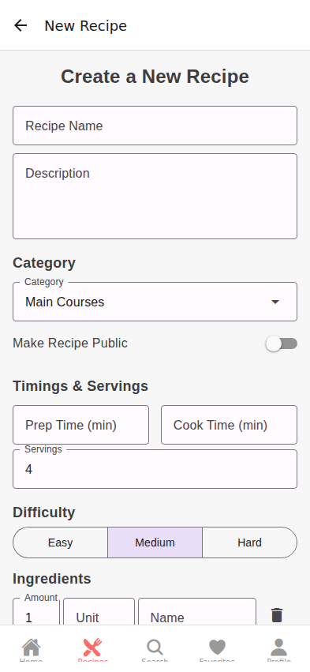 |
| **Search** | 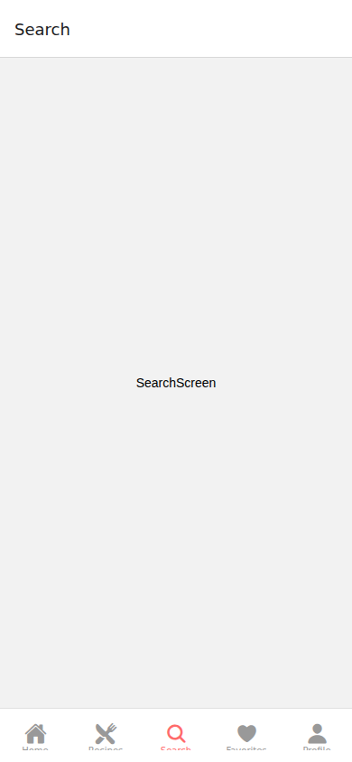 | 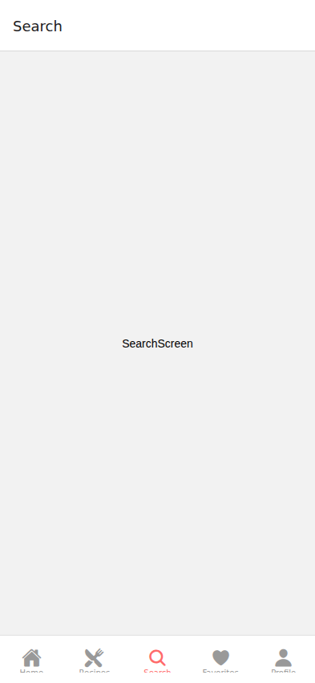 |
| **Profile** | 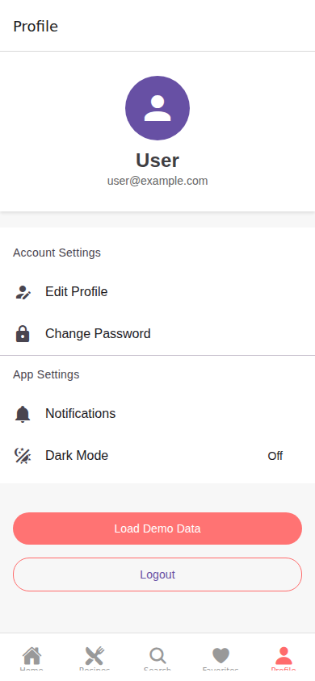 | 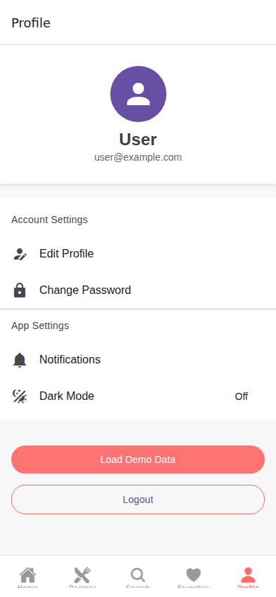 |

## 🎯 Features

### Core Features
- ✅ Create and edit recipes
- ✅ Categorization of recipes (Appetizers, Main Courses, Desserts, etc.)
- ✅ Detailed preparation instructions
- ✅ Search recipes (by name and ingredients)
- ✅ Ingredient-based search
- ✅ Automatic serving calculation (Default: 4 servings)
- ✅ Easy sharing (WhatsApp, Mail, SMS)
- ✅ Favorites system
- ✅ Photo upload (multiple photos per recipe)

### Premium Features
- 🎯 Step-by-step cooking mode with timer
- 🛒 Integrated shopping list
- 📊 Nutritional value calculation
- 🌙 Dark Mode
- 📱 Offline Mode
- 👥 Community Features
- ⭐ Rating system

## 🛠️ Technology Stack

### Frontend
- **React Native** - Cross-Platform Mobile Development
- **Expo** - Development tools and build system
- **TypeScript** - Type-Safe Development
- **React Navigation** - Navigation & Routing
- **React Native Paper** - UI Component Library

### Backend
- **Firebase** - Backend-as-a-Service
  - **Firestore** - NoSQL Database
  - **Authentication** - User Management
  - **Storage** - Cloud Storage for photos
  - **Cloud Functions** - Serverless Backend Logic

### Tools & Libraries
- **Redux Toolkit** - State Management
- **React Query** - Data Fetching & Caching
- **Zod** - Schema Validation
- **React Hook Form** - Form Management
- **date-fns** - Date Utilities
- **expo-image-picker** - Photo Selection
- **expo-sharing** - Sharing Functionality

## 📁 Project Structure

```
yummi-share/
├── app/                 # Navigation & App Root
├── assets/              # Images, Fonts, Icons
├── components/          # Reusable UI Components
├── config/              # Configuration Files
├── screens/             # App Screens
│   ├── auth/           # Authentication Screens
│   ├── recipe/         # Recipe Screens
│   ├── search/         # Search Screens
│   └── profile/        # Profile Screens
├── services/           # API Services
├── utils/              # Utility Functions
└── types/              # TypeScript Type Definitions
```

## 🚀 Quick Start

### Prerequisites
- Node.js 18+
- npm or yarn
- Expo CLI
- iOS: Xcode (for Mac)
- Android: Android Studio

### Installation

```bash
# Clone repository
git clone https://github.com/Bladestar2105/YummiShare.git
cd YummiShare

# Install dependencies
npm install

# Start development server
npm start

# Start app on device/emulator
npm run ios    # for iOS
npm run android  # for Android
```

## 📱 App Screens

### Authentication
- Login Screen
- Register Screen
- Forgot Password

### Recipe Management
- Recipe List Screen (Home)
- Recipe Detail Screen
- Create/Edit Recipe Screen
- My Recipes Screen
- Favorites Screen

### Search
- Search Screen (by Name)
- Ingredient Search Screen
- Category Filter Screen

### User
- Profile Screen
- Settings Screen
- Shopping List Screen

## 🎨 Design System

### Colors
- Primary: #FF6B6B (Coral Red)
- Secondary: #4ECDC4 (Teal)
- Background: #F7F7F7
- Surface: #FFFFFF
- Text: #333333
- Text Light: #666666

### Typography
- Font Family: System UI
- Headline: Bold 24px
- Title: Semi-Bold 20px
- Body: Regular 16px
- Caption: Regular 14px

## 🔧 Configuration

### Firebase Setup
1. Create Firebase project at https://console.firebase.google.com
2. Add Android app and add `google-services.json` to `android/app/`
3. Add iOS app and add `GoogleService-Info.plist` to `ios/YummiShare/`
4. Adjust Firebase Configuration in `config/firebase.ts`

## 📄 Data Models

### Recipe
```typescript
{
  id: string
  name: string
  description: string
  category: string
  images: string[]
  prepTime: number
  cookTime: number
  servings: number
  ingredients: Ingredient[]
  steps: string[]
  tags: string[]
  isFavorite: boolean
  createdAt: Date
  updatedAt: Date
  userId: string
}
```

### Ingredient
```typescript
{
  id: string
  name: string
  amount: number
  unit: string
}
```

## 🧪 Testing

```bash
# Unit Tests
npm test

# E2E Tests
npm run test:e2e
```

## 📦 Build & Deployment

### Development Build
```bash
npm run dev
```

### Production Build
```bash
# Android
npm run build:android

# iOS
npm run build:ios
```

### App Store & Play Store
- Follow the official Expo deployment guides
- Prepare app icons and splash screens
- Configure app signing

## 🤝 Contributing

1. Fork the repository
2. Create Feature Branch (`git checkout -b feature/AmazingFeature`)
3. Commit Changes (`git commit -m 'Add some AmazingFeature'`)
4. Push to Branch (`git push origin feature/AmazingFeature`)
5. Open Pull Request

## 📝 License

This project is licensed under the MIT License.

## 👥 Team

- **Developer**: Bladestar2105
- **Project**: YummiShare

## 📞 Contact

For questions or issues: Please create an issue in the repository.

---

**Made with ❤️ for Food Lovers**
